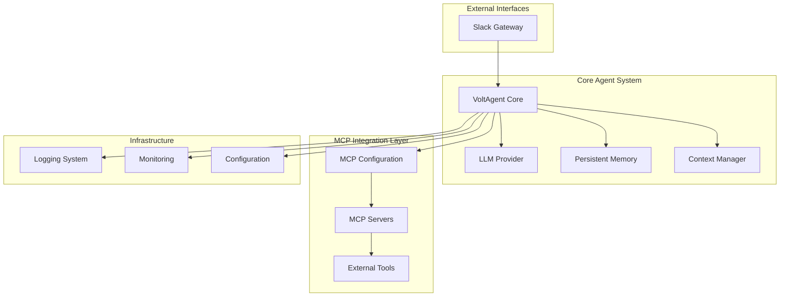

# Design Document

## Overview

Common Creation Agentは、voltagent.devプラットフォームを基盤とした汎用AIエージェントシステムです。このシステムは、LLMとの対話機能を核として、MCP（Model Context Protocol）による外部ツール連携、Slackゲートウェイを統合し、スケーラブルで拡張可能なAIエージェント環境を提供します。

## Architecture

### システム全体アーキテクチャ



### レイヤー構成

1. **Interface Layer**: Slackの外部インターフェース
2. **Core Agent Layer**: VoltAgentを使用したメインエージェント処理
3. **MCP Integration Layer**: 外部ツールとの連携を管理
4. **Infrastructure Layer**: ログ、監視、設定管理

## Components and Interfaces

### 1. Core Agent Component

**VoltAgent Core**
- **責任**: メインのAIエージェント処理、対話管理
- **技術**: @voltagent/core, @voltagent/vercel-ai
- **インターフェース**:
  ```typescript
  interface AgentCore {
    processMessage(message: string, context: ConversationContext): Promise<AgentResponse>
    initializeAgent(config: AgentConfig): Promise<void>
    shutdown(): Promise<void>
  }
  ```

**LLM Provider**
- **責任**: OpenAI/AWS BedrockとのLLM通信
- **技術**: @ai-sdk/openai, @ai-sdk/amazon-bedrock, @voltagent/vercel-ai
- **設定**: 環境変数によるAPIキー/AWS認証情報管理

### 2. MCP Integration Component

**MCP Configuration Manager**
- **責任**: MCP サーバーとの接続管理、ツール取得
- **技術**: @voltagent/core MCPConfiguration
- **インターフェース**:
  ```typescript
  interface MCPManager {
    initializeServers(config: MCPServerConfig[]): Promise<void>
    getAvailableTools(): Promise<Tool[]>
    executeToolCall(toolName: string, params: any): Promise<any>
    disconnect(): Promise<void>
  }
  ```

**サポートするMCPサーバータイプ**:
- HTTP/HTTPS サーバー
- stdio ベースサーバー
- SSE (Server-Sent Events) サーバー

### 3. Interface Components

**Slack Gateway**
- **責任**: Slack APIとの連携、メッセージ処理
- **技術**: @slack/bolt-js
- **機能**:
  - メンション検知
  - スレッド対応
  - ファイル添付対応
  - エラーハンドリング


### 4. Infrastructure Components

**Configuration Manager**
- **責任**: 設定ファイル管理、環境変数処理
- **形式**: YAML設定ファイル + mcp.json (MCP設定) + 環境変数
- **設定項目**:
  - LLM設定 (OpenAI/AWS Bedrock)
  - MCP サーバー設定 (mcp.json形式)
  - Slack設定
  - ログ設定

**Logging System**
- **責任**: 構造化ログ出力、ログローテーション
- **技術**: Winston/Pino
- **ログレベル**: ERROR, WARN, INFO, DEBUG

**Monitoring System**
- **責任**: システム監視、メトリクス収集
- **技術**: VoltOps Platform連携
- **監視項目**:
  - レスポンス時間
  - エラー率
  - リソース使用量

## Data Models

### Core Data Models

```typescript
// 会話コンテキスト
interface ConversationContext {
  sessionId: string
  userId: string
  channelId?: string // Slack用
  history: Message[]
  metadata: Record<string, any>
  createdAt: Date
  updatedAt: Date
}

// メッセージ
interface Message {
  id: string
  role: 'user' | 'assistant' | 'system'
  content: string
  timestamp: Date
  metadata?: Record<string, any>
}

// エージェント応答
interface AgentResponse {
  content: string
  toolCalls?: ToolCall[]
  metadata?: Record<string, any>
  error?: string
}

// ツール呼び出し
interface ToolCall {
  toolName: string
  parameters: Record<string, any>
  result?: any
  error?: string
}

// 設定モデル
interface AgentConfig {
  llm: {
    provider: 'openai' | 'bedrock'
    model: string
    apiKey?: string // OpenAI用
    region?: string // AWS Bedrock用
    maxTokens?: number
    temperature?: number
  }
  slack?: {
    botToken: string
    appToken: string
    signingSecret: string
  }
  logging: {
    level: string
    format: string
  }
}

// MCP設定は別途mcp.jsonで管理
interface MCPConfig {
  mcpServers: Record<string, MCPServerConfig>
}

interface MCPServerConfig {
  command: string
  args?: string[]
  env?: Record<string, string>
  disabled?: boolean
  autoApprove?: string[]
}
```

### データ永続化

**Memory Storage**
- **技術**: VoltAgent内蔵メモリシステム
- **用途**: 会話履歴、ユーザープリファレンス
- **形式**: JSON/SQLite

**Configuration Storage**
- **技術**: ファイルシステム
- **場所**: `./config/` ディレクトリ
- **形式**: YAML設定ファイル + mcp.json (MCP設定)

## Error Handling

### エラー分類と処理戦略

**1. LLM API エラー**
- **種類**: レート制限、認証エラー、サービス停止
- **処理**: 指数バックオフによるリトライ、フォールバック応答

**2. MCP 接続エラー**
- **種類**: サーバー接続失敗、プロトコルエラー
- **処理**: 自動再接続、エラー通知、グレースフルデグラデーション

**3. Slack API エラー**
- **種類**: 認証エラー、メッセージ送信失敗
- **処理**: エラーログ記録、ユーザー通知、再送機能

**4. システムエラー**
- **種類**: メモリ不足、ファイルI/Oエラー
- **処理**: アラート生成、自動復旧、ログ記録

### エラーハンドリング実装

```typescript
class ErrorHandler {
  static async handleLLMError(error: LLMError): Promise<string> {
    if (error.type === 'rate_limit') {
      await this.exponentialBackoff(error.retryAfter)
      return 'システムが一時的に混雑しています。しばらくお待ちください。'
    }
    // その他のエラー処理...
  }
  
  static async handleMCPError(error: MCPError): Promise<void> {
    logger.error('MCP Error', { error: error.message, server: error.serverName })
    // 再接続試行...
  }
}
```

## Testing Strategy

### テスト階層

**1. Unit Tests**
- **対象**: 個別コンポーネント、ユーティリティ関数
- **技術**: Jest, Vitest
- **カバレッジ**: 90%以上

**2. Integration Tests**
- **対象**: MCP連携、LLM通信、Slack API
- **技術**: Jest + Test Containers
- **モック**: 外部API呼び出し

**3. End-to-End Tests**
- **対象**: 完全なユーザーフロー
- **技術**: Playwright
- **シナリオ**: Slack対話

**4. Performance Tests**
- **対象**: レスポンス時間、同時接続数
- **技術**: Artillery, k6
- **メトリクス**: 95パーセンタイル応答時間 < 2秒

### テスト実装例

```typescript
// Unit Test例
describe('AgentCore', () => {
  test('should process simple message', async () => {
    const agent = new AgentCore(mockConfig)
    const response = await agent.processMessage('Hello', mockContext)
    expect(response.content).toBeDefined()
  })
})

// Integration Test例
describe('MCP Integration', () => {
  test('should connect to filesystem MCP server', async () => {
    const mcpManager = new MCPManager()
    await mcpManager.initializeServers([filesystemServerConfig])
    const tools = await mcpManager.getAvailableTools()
    expect(tools.length).toBeGreaterThan(0)
  })
})
```

## Security Considerations

### セキュリティ要件

**1. API キー管理**
- 環境変数による管理
- 設定ファイルでの平文保存禁止
- キーローテーション対応

**2. MCP サーバーセキュリティ**
- 信頼できるサーバーのみ接続
- サンドボックス化された実行環境
- 入力検証とサニタイゼーション

**3. Slack セキュリティ**
- 署名検証
- トークン検証
- レート制限

**4. データ保護**
- 会話データの暗号化
- PII データの匿名化
- データ保持期間の制限

### セキュリティ実装

```typescript
class SecurityManager {
  static validateSlackSignature(signature: string, body: string): boolean {
    // Slack署名検証実装
  }
  
  static sanitizeUserInput(input: string): string {
    // 入力サニタイゼーション実装
  }
  
  static encryptSensitiveData(data: string): string {
    // データ暗号化実装
  }
}
```

## Deployment Architecture

### 開発環境
- **実行方法**: `npm run dev`
- **設定**: `.env.development`
- **MCP**: ローカルstdioサーバー

### 本番環境
- **プラットフォーム**: VoltAgent Cloud / Docker
- **設定**: 環境変数
- **MCP**: HTTPSサーバー
- **監視**: VoltOps Platform

### 設定管理

```yaml
# config/agent.yml
agent:
  name: "Common Creation Agent"
  description: "汎用AIエージェント"
  
llm:
  provider: "openai" # または "bedrock"
  model: "gpt-4o-mini" # または "anthropic.claude-3-5-sonnet-20241022-v2:0"
  maxTokens: 4096
  temperature: 0.7
  # OpenAI用設定
  # apiKey: 環境変数 OPENAI_API_KEY から取得
  # AWS Bedrock用設定
  # region: "us-east-1"
  # AWS認証情報は環境変数から取得

slack:
  enabled: true
  channels: ["general", "ai-assistant"]

logging:
  level: "info"
  format: "json"
  rotation: "daily"
```

```json
// mcp.json
{
  "mcpServers": {
    "filesystem": {
      "command": "npx",
      "args": ["-y", "@modelcontextprotocol/server-filesystem", "./data"],
      "disabled": false,
      "autoApprove": ["read_file", "write_file", "list_directory"]
    },
    "context7": {
      "command": "npx",
      "args": ["-y", "@upstash/context7-mcp"],
      "disabled": false,
      "autoApprove": ["resolve-library-id", "get-library-docs"]
    }
  }
}
```